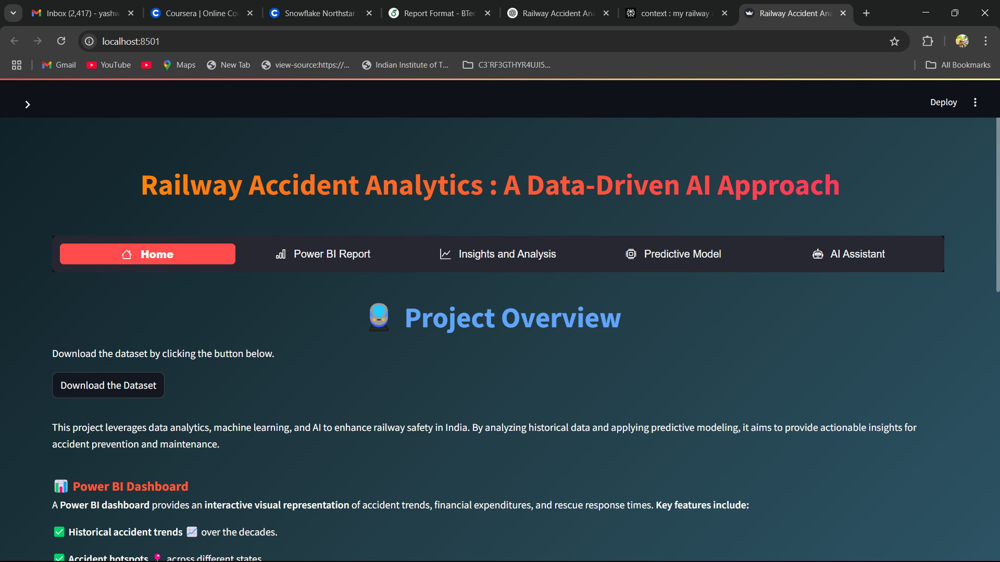

# 🚄 Railway Accident Analytics Platform 📊


## 🌟 Overview

**All aboard!** 🚂 This project is your one-stop destination for diving deep into railway accident data. We're not just talking about numbers here; we're talking about building a smarter, safer railway system. 🧠 Using a blend of data science, machine learning, and AI, this platform helps you:

-   🔍 Analyze historical trends
-   🔮 Predict potential accidents
-   🚑 Estimate resource needs
-   🤖 Get AI-powered insights

Whether you're a railway enthusiast, a data scientist, or a safety engineer, this project's got something for you! 🛠️

## ✨ Key Features

-   **📊 Interactive Dashboards:** Explore eye-catching visualizations with Streamlit and Power BI. See accident hotspots, causal factors, and much more! 🌍
-   **🤖 AI-Powered Insights:** Chat with our LLaMA-powered AI assistant and get instant answers to your burning questions. Ask about anything from accident stats to safety recommendations! 💬
-   **🔮 Predictive Modeling:** Dive into machine learning with our Random Forest Regressor. Predict accident severity and understand what factors matter most. 🌳
-   **🚑 Resource Estimation:** Be prepared for anything! Our platform estimates the number of ambulances needed and the potential structural damage costs. 💰

## 🛠️ Tech Stack

This project wouldn't be possible without these amazing technologies:

-   🐍 **Python:** The heart and soul of our data analysis and machine learning.
-   🎈 **Streamlit:** Creating beautiful, interactive web apps has never been easier!
-   🐼 **Pandas:** Wrangling data like a pro.
-   📏 **Scikit-learn:** Machine learning magic at your fingertips.
-   🎨 **Matplotlib & Seaborn:** Visualizing data in style.
-   ☁️ **Power BI (Optional):** For even more advanced, interactive dashboards.
-   🧠 **Groq API:** Powering our AI assistant with the incredible LLaMA model.

## 🚀 Get Started

Ready to jump in? Follow these simple steps:

1.  **Clone the Repository:**

    ```
    git clone [Your Repo Link]
    cd Railway-Accident-Analytics-Platform
    ```

2.  **Install Dependencies:**

    Make sure you have all the required libraries.

    ```
    pip install -r requirements.txt
    ```

3.  **Set Up Your Groq API Key:**

    -   Get your API key from [Groq](https://console.groq.com/keys).
    -   Update `llama_Assitant.py` with your key:

    ```
    GROQ_API_KEY = "YOUR_GROQ_API_KEY"  # 🔑 Add Here
    ```

4.  **Run the App:**

    Fire up the Streamlit app and let the magic begin!

    ```
    streamlit run main.py
    ```

    Open your browser and visit the local URL provided by Streamlit (usually `http://localhost:8501`). 🌐

## 🗂️ Project Structure

```
├── main.py                   # 🚀 Main Streamlit application
├── pages/                    # 📄 Individual app pages
│   ├── Home_overview.py         # 🏠 Home page overview
│   ├── Insights_and_Analysis.py # 🔍 Exploratory data analysis and insights
│   ├── Power_BI_Report.py       # 📊 Embedded Power BI dashboard
│   ├── Predictive_Model.py      # 🌳 Predictive modeling for accident severity
│   └── llama_Assistant.py       # 🤖 AI assistant powered by LLaMA
├── data/                     # 💾 Datasets
│   ├── train_accident_analysis-dataset.csv # 📜 Raw historical accident data
│   └── enhanced_accident_data.csv          # ✨ Enhanced dataset for modeling
├── README.md                  # 📖 Project overview and guide
└── requirements.txt           # 📦 Python dependencies
```

## 🧩 Module Breakdown

Let's break down what each module does:

-   **🏠 Home Overview:** A friendly introduction to the project.
-   **🔍 Insights and Analysis:** Dive into visualizations and analysis of accident data.
-   **📊 Power BI Report:** (Optional) Integrate your advanced Power BI dashboards.
-   **🌳 Predictive Model:** Predict accident severity and estimate resources.
-   **🤖 AI Assistant:** Chat with LLaMA and get instant answers to your questions.

## 💾 Data Sources

-   `train_accident_analysis-dataset.csv`: Historical accident records.
-   `enhanced_accident_data.csv`: Enhanced dataset with preprocessed features.

## 🤝 Contributing

Want to make this project even better? Contributions are always welcome! Feel free to fork the repository, make your changes, and submit a pull request. 💖

## 📜 License

This project is licensed under the **MIT License**. See the `LICENSE` file for more details. 📝

📫 Connect with me on [LinkedIn](https://www.linkedin.com/in/yashwanth-sai-kasarabada-ba4265258/)
 Happy analyzing! 🚀✨


