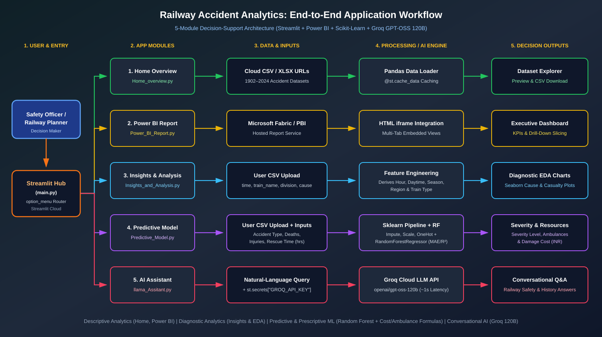
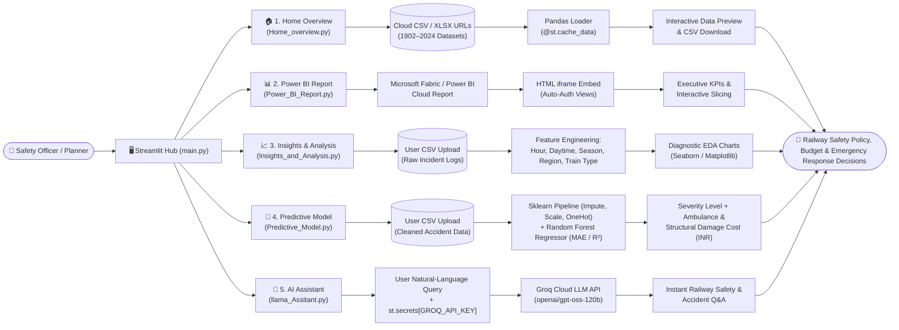

# Railway Accident Analytics — End-to-End Workflow Diagram

## 1. Visual Image

## 2. Mermaid Flowchart (GitHub / Markdown Compatible)

```mermaid
flowchart LR
    User(["👤 Safety Officer / Planner"]) --> App["🖥️ Streamlit Hub (main.py)"]

    App --> M1["🏠 1. Home Overview\n(Home_overview.py)"]
    App --> M2["📊 2. Power BI Report\n(Power_BI_Report.py)"]
    App --> M3["📈 3. Insights & Analysis\n(Insights_and_Analysis.py)"]
    App --> M4["🔮 4. Predictive Model\n(Predictive_Model.py)"]
    App --> M5["🤖 5. AI Assistant\n(llama_Assitant.py)"]

    %% Module 1
    M1 --> D1[("Cloud CSV / XLSX URLs\n(1902–2024 Datasets)")]
    D1 --> P1["Pandas Loader\n(@st.cache_data)"]
    P1 --> Out1["Interactive Data Preview\n& CSV Download"]

    %% Module 2
    M2 --> D2["Microsoft Fabric / Power BI\nCloud Report"]
    D2 --> P2["HTML iframe Embed\n(Auto-Auth Views)"]
    P2 --> Out2["Executive KPIs &\nInteractive Slicing"]

    %% Module 3
    M3 --> D3[("User CSV Upload\n(Raw Incident Logs)")]
    D3 --> P3["Feature Engineering:\nHour, Daytime, Season, Region, Train Type"]
    P3 --> Out3["Diagnostic EDA Charts\n(Seaborn / Matplotlib)"]

    %% Module 4
    M4 --> D4[("User CSV Upload\n(Cleaned Accident Data)")]
    D4 --> P4["Sklearn Pipeline (Impute, Scale, OneHot)\n+ Random Forest Regressor (MAE / R²)"]
    P4 --> Out4["Severity Level + Ambulance &\nStructural Damage Cost (INR)"]

    %% Module 5
    M5 --> D5["User Natural-Language Query\n+ st.secrets[GROQ_API_KEY]"]
    D5 --> P5["Groq Cloud LLM API\n(openai/gpt-oss-120b)"]
    P5 --> Out5["Instant Railway Safety &\nAccident Q&A"]

    %% Final Decision Layer
    Out1 & Out2 & Out3 & Out4 & Out5 --> Decision(["🎯 Railway Safety Policy, Budget & Emergency Response Decisions"])
```
